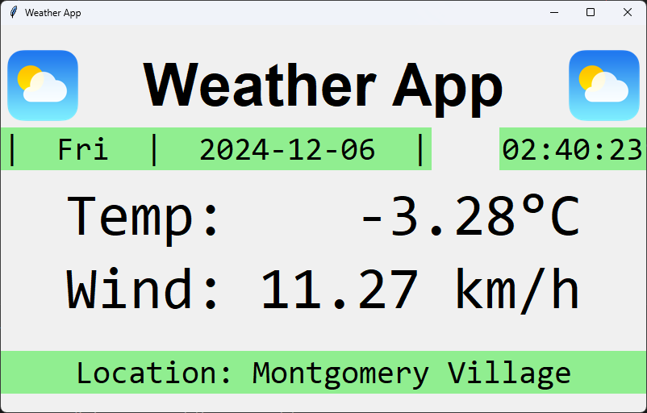

# weather display app
simple tkinter desktop app to run on raspberry pi with connected display for easy access to weather information and datetime

## before you run the app ...

1. make a file called key.yaml.
2. store your openweathermap api key like so:
    ```
    api_key: "your key as a string, in double quotes"
    ```

## sample display



change requests:
1. use weather icons
2. resize icons
3. make a button to go full screen
4. make a startup argument for full screen (arg parse?)
